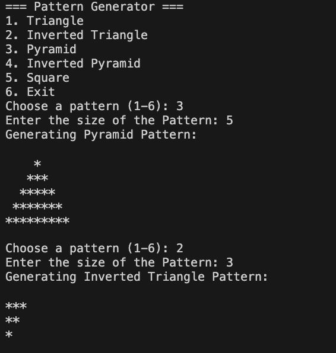

Pattern Generator

Description
The Pattern Generator is a C# console application that allows users to generate various star patterns. Users can choose the type of pattern and its size. The program prints the pattern in the terminal and also saves it to a text file called patterns.txt for later reference.

Available patterns include:

Triangle

Inverted Triangle

Pyramid

Inverted Pyramid

Square

Features

Console-based menu for easy interaction

Generates multiple patterns using loops and string manipulation

Saves all generated patterns automatically to a text file

Input validation ensures users select valid options

Program continues running until the user chooses to exit

How to Run

Make sure .NET SDK 6 or higher is installed

Open a terminal in the project directory

Run the program using the command: dotnet run

Follow the prompts to choose a pattern and enter its size

The pattern will be printed in the terminal and saved to patterns.txt

To exit, choose option 6 from the menu

All generated patterns are also saved in patterns.txt for future reference

File Structure

PatternGenerator.cs — Main C# program

patterns.txt — Generated patterns (created automatically)

README.txt — Project documentation

Notes

Demonstrates object-oriented programming, loops, conditionals, and file handling

Patterns are generated dynamically based on user input

File handling uses StreamWriter to append multiple patterns to a text file
